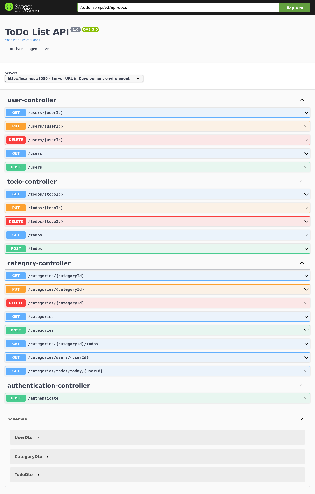

# Todo List API

## Description
This project is a Spring Boot application that exposes REST APIs to manage a Todo List. It allows creating, reading, updating, and deleting tasks.

## Prerequisites
- Java 17
- Maven 3
- Spring Boot 3.1.4
- A database (H2, MySQL)

## Installation

### Clone the Project
```bash
git clone https://github.com/hichameaa/todolist-backend.git
cd todolist-backend
```

### Build the Project
```bash
mvn clean install
```

### Run the Application
```bash
mvn spring-boot:run
```

## Usage
### API Documentation
You can view the API documentation and test the endpoints using Swagger. Once the application is running, navigate to http://localhost:8080/todolist-api/swagger-ui.html.



## Testing
To run unit and integration tests, use the following command:
```bash
mvn test
```